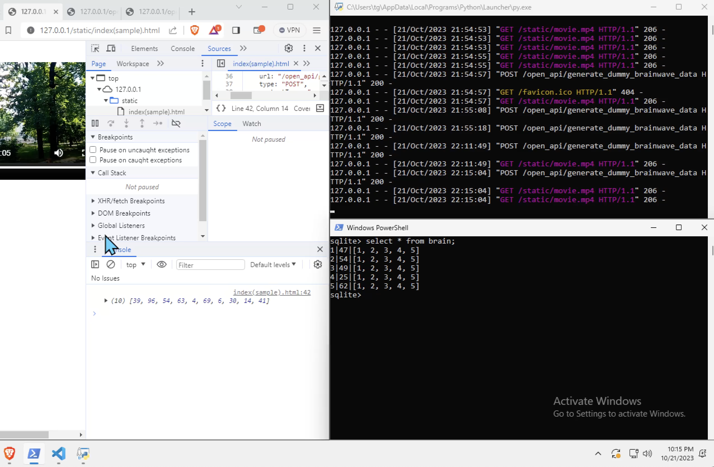
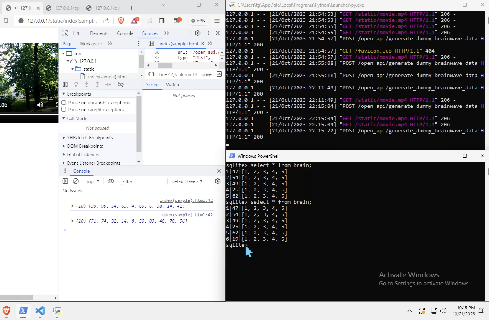

# neurobit-dating (dummy data)
A dating app utilizing Brainbit headset

This approach is for the sake of understanding and configuring also applying insertions to the database file 'local_data_base' when the video gets played.

Since we may not always be having the headband readily available, also that the 
BrainBit's neurosdk2 module requires the interaction with the headband, making dummy data may help familiarize ourselves into approaching how we may interact with the app.

Run
<br>
```./app.py```

Type the URL that it associates with 
the loopback address and include the page
"index(sample).html"

```loopback/index(sample).html```

Record gets created in db file:


New record gets created in local_data_base file, as the video gets played:

